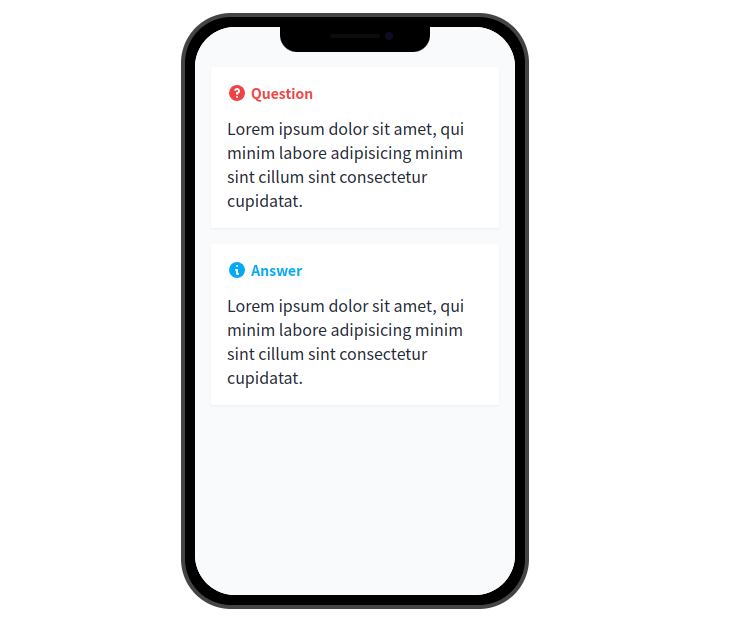

## Anki Azul Template

[English][0] | 简体中文

简洁风格的 Anki 卡片模板。

[在线预览][1]

旧版本的该套模板可以在[这里][2]找到。

## 内容特性

- 基础的问答类型卡片
- 英语和西语的单词卡片，附带在线语音支持。
- 在 AnkiDroid 上的使用体验更佳。

## 如何使用

从 [release][4] 页面下载最新版本的模板并导入.

## 开发

所有的卡片模板位于 `templates` 目录下，并使用 tailwind css 来生成卡片的的样式。运行 `yarn gen` 为所有的卡片生成 css 样式文件。

在 `tools` 目录下有一个 rust 写的小工具，用来打包生成 `apkg` 文件。（感谢 [genanki-rs][3]）

[0]: README.md
[1]: https://anki-azul-template.vercel.app/
[2]: https://github.com/TunkShif/Anki-Azul-Template/tree/legacy
[3]: https://github.com/yannickfunk/genanki-rs
[4]: https://github.com/TunkShif/Anki-Azul-Template/releases
